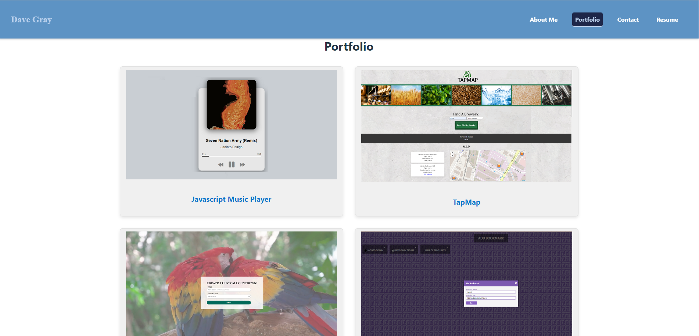

# Module 20 React Challenge: React Portfolio

## Description

This portfolio, built using React, showcases my web development projects and skills. It's a demonstration of my proficiency in single-page application development, aimed at potential employers and fellow developers.

## Table of Contents

- [Installation](#installation)
- [Usage](#usage)
- [Credits](#credits)
- [License](#license)

## Installation

Detailed steps on setting up this project will be provided here.

## Usage

For usage instructions and examples, refer to this section. Below is a sample image from the application:

## Credits

- ChatGPT for code snippets and README assistance
- [FontAwesome](https://fontawesome.com/) for React icons
- [Coding Bootcamp at University of Texas at Austin via EdX](https://www.edx.org/)

## License

This project is licensed under [MIT](https://choosealicense.com/licenses/mit/).

## Features

List all the significant features of your project here.

## How to Contribute

Guidelines for contributing to this project can be found here.

## Tests

Instructions for testing the application are provided here.

